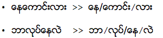
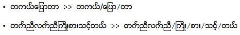
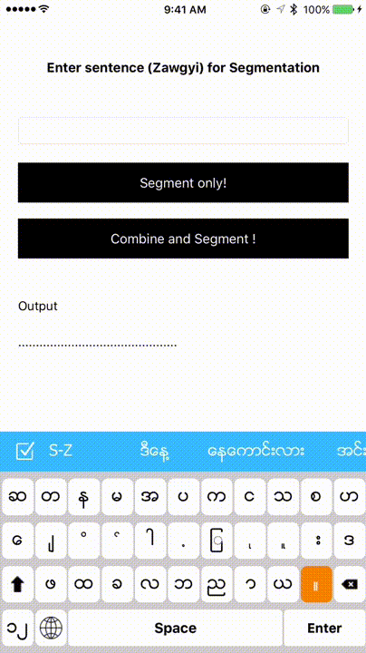

# Zawgyi Segmentation

[](http://cocoapods.org/pods/ZawgyiSegmentation)
[](http://cocoapods.org/pods/ZawgyiSegmentation)
[](http://cocoapods.org/pods/ZawgyiSegmentation)

## Description

This is for segmenting sentence written in Zawgyi. Example is shown below. 



You can also combine meaningful words together like this.



To run this project, clone the repo, and run `pod install` from the project directory first.

## Output



## Usuage

Simply put your input string and get segmented words back in array. 

```obj-c
NSArray *arr = [ZawgyiSegmentationHelper convertZawgyiSentence:self.txtInput.text andWillCombineWord:NO];

```

## Installation

ZawgyiSegmentation is available through [CocoaPods](http://cocoapods.org). To install
it, simply add the following line to your Podfile:

```ruby
pod "ZawgyiSegmentation"
```

## Note

Initially, it is created in C# last 5 years ago. I just convert everything to Objective-c and make it as cocoapods. You can edit/use this project as you like. This can be used to make word wrap for Zawgyi sentence.  Please feel free to contact me.

## Author

Khant Thu Linn

## License

ZawgyiSegmentation is available under the MIT license. See the LICENSE file for more info.
